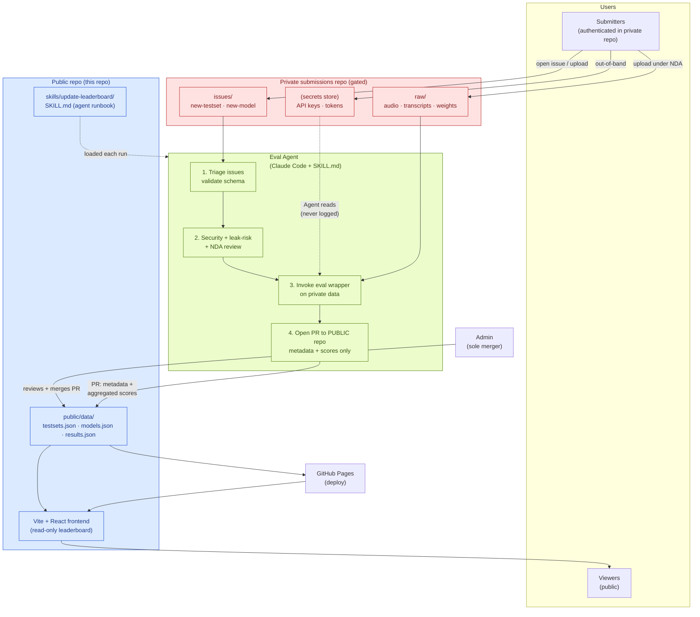

# Azure Voice Agent Incubation Lab — Model Leaderboard

> The **Incubation Lab** builds voice agents for vertical scenarios —
> automotive, contact center, meeting rooms, smart home, mobile.
> This site tracks the **TTS** and **ASR** models evaluated by our Agent
> for those scenarios.

Ranks model performance on real customer test sets (Toyota, LGE, SAIC,
Stellantis-BR, Internal, …), filterable by scenario, customer, language
tier (1/2/3), commercial sales region (Americas, LATAM, EMEA, MidEast,
Africa, Greater-China, Japan-Korea, Southeast-Asia, India-South-Asia),
deployment type (cloud-api, cloud-self-hosted, on-device,
on-prem-server), hardware (CPU/GPU/NPU/DSP/TPU), and runtime (CUDA,
Qualcomm AI Engine, CoreML, ONNX Runtime, …).

- **TTS metrics:** MOS · First-Byte Latency (P50 / P95) · Pronunciation Accuracy (发音准确度) · RTF
- **ASR streaming:** WER/CER · Final-Result Latency (P50 / P95) · Intermediate-Result Latency · First-Byte Latency · RTF
- **ASR batch:** WER/CER · Final-Result Latency (P50 / P95) · First-Byte Latency · RTF

**This site is read-only.** Raw datasets, model weights, and API keys
never land in this public repo — submissions flow through a private
repo and only sanitized metadata + scores are published here. See the
[Contribute](#for-contributors) section below.

---

## For users

Browse and filter the leaderboard by task, scenario, customer,
language tier/region, deployment, hardware, runtime. Group results
by scenario, by customer, or "vendor — best only".

## For contributors

Test sets, models, and keys never live in this public repo. To submit:

1. Open an issue in the **private submissions repo** (link in
   [docs/ADMIN.md](docs/ADMIN.md)) using the `New test set` or
   `New model` issue form.
2. Upload raw data / weights to the private repo's restricted path
   (admins grant write access once an NDA is on file).
3. Hand API keys to the admin **out-of-band** — GitHub Actions secret,
   Azure Key Vault, or direct hand-off. Never paste a key into an
   issue, PR, or commit.
4. The Agent picks the issue up, validates schema, runs the security /
   leak-risk / NDA checklist, invokes evaluation against the private
   dataset, and opens a PR against **this** public repo that adds only
   the sanitized metadata row and the new scores.

The Contribute page on the live site repeats these steps for
submitters who arrive via the UI.

## For admins — set up the Agent that updates the website

The leaderboard is updated by an Agent (Claude Code or the Claude Agent
SDK) running on a schedule. The Agent never merges its own work — it
opens PRs that an admin reviews and merges.

### System diagram



### Trust boundaries

- **Public repo (this one)**: anyone can read. Only the Agent (via PR)
  and the admin (via merge) can write. It carries evaluation scripts,
  the Agent skill, and aggregated leaderboard JSON — never raw audio,
  weights, or keys.
- **Private submissions repo**: gated to NDA-signed contributors. Raw
  datasets, model weights, and anything customer-confidential live
  here. The Agent reads it but **never mirrors file bytes into the
  public repo**.
- **API keys / tokens**: transferred out-of-band into a secrets store
  the Agent can read. Never written to either repo.
- **The admin** is the sole merger on the public repo and the only
  role that can sign off on NDA-bearing customer test sets or
  submissions labeled `leak-risk-review`.

### Failure modes the Agent refuses

- Missing evaluation wrapper → skip runs, leave existing numbers,
  note in PR.
- Invalid submission schema → leave the issue open with a checklist
  of fixes.
- API keys found in any issue body, PR, or committed file → strip,
  flag as a security incident, stop processing that submission.
- Raw dataset bytes, weight files, or transcripts proposed for the
  public repo → refuse and file back to the private repo.

### Quick start

1. **Install** Claude Code on the machine that will host the Agent
   (any platform with a long-lived shell). See
   [docs/AGENT_SETUP.md](docs/AGENT_SETUP.md) for full details.
2. **Give the Agent read access** to the private submissions repo and
   write access to this public repo (fine-grained PATs — one per repo).
3. **Wire up the skill**:
   ```bash
   mkdir -p ~/.claude/skills
   ln -s "$PWD/skills/update-leaderboard" ~/.claude/skills/update-leaderboard
   ```
4. **Test it once** interactively:
   ```bash
   cd /path/to/speech-vertical-leaderboard
   claude
   > /update-leaderboard
   ```
5. **Schedule it** — pick one:
   - Inside `claude`: `/loop 6h /update-leaderboard`.
   - Cron / Task Scheduler: `claude -p "/update-leaderboard"` every N hours.
   - GitHub Actions: see `docs/AGENT_SETUP.md` for the workflow template.
6. **Review and merge** the PRs the Agent opens against this public
   repo. The PR body contains a per-submission security / leak-risk
   checklist to verify against the diff.

### What the admin must verify by hand

- Anything labeled `permanent-review`, `leak-risk-review`, or
  `customer-data`.
- That the public PR diff contains **only metadata and scores** —
  never audio bytes, transcripts, weights, or keys.
- NDAs for new customer-named test sets before granting write access
  to the private repo.

Full checklist: [docs/ADMIN.md](docs/ADMIN.md).

## Repo layout

```
.
├── public/data/             # Agent-updated leaderboard JSON (served at runtime)
│   ├── testsets.json        # metadata only — no audio / transcripts
│   ├── models.json          # metadata only — no weights / keys
│   └── results.json         # aggregated scores
├── src/                     # Vite + React + TS + Tailwind frontend (read-only)
├── skills/
│   └── update-leaderboard/  # The Agent skill
│       └── SKILL.md
├── docs/
│   ├── ADMIN.md             # Security / leak-risk / NDA checklist + private-repo link
│   └── AGENT_SETUP.md       # How to run and schedule the Agent
└── .github/workflows/
    └── deploy.yml           # GitHub Pages deploy
```

The private submissions repo (structure maintained by the admin) holds
issues, uploaded raw datasets, and model weights — it is **not**
mirrored here.

## Local development

```bash
npm install
npm run dev
```

Then open the URL Vite prints. The site reads
`public/data/{testsets,models,results}.json` at runtime.

For real GitHub OAuth on the deployed site, set
`VITE_GITHUB_CLIENT_ID` to your OAuth App's client ID at build time.
Sign-in is only used to badge the Contribute page; the leaderboard
itself is public and works signed-out.

## License

Internal Incubation Lab project.
